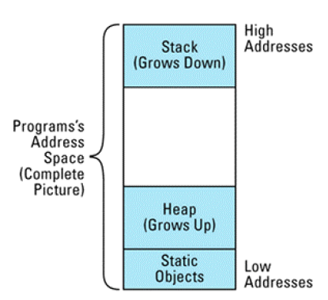

## 将构造函数和非成员函数虚拟化

根据所读取的数据建立了一个新对象,因为能建立新对象,行为与构造函数相似,而且因为能建立不同类型的对象,称为虚拟构造函数。


class NLcomponent
{
public:
  virtual ~NLcomponent(){};
};

class TextBlock:public NLcomponent
{

public:
  virtual ~TextBlock(){}
};

class Graphic:public NLcomponent
{
public:
  virtual ~Graphic(){}
};

class NewsLetter
{
private:
    list<NLcomponent *> component;
    NLcomponent * readComponent(istream& str)
    {
        char a;
        while (str >> a)
        {
            if (a >= '0' && a <= '9')//依据不同输入构造不同的对象，此处无法使用智能指针
                return (new TextBlock());
            else
                return (new Graphic());
        }
        return new NLcomponent();
    }
public:
    NewsLetter(istream& str);
    ~NewsLetter()
    {
        for(list<NLcomponent*>::iterator it = component.begin();it != component.end(); it++)
        {
            delete (*it);//析构函数为虚拟函数，所以会调用对应的析构函数
        }
    }
    
};

NewsLetter::NewsLetter(istream& str)
{
    while(str)
    {
        component.push_back(readComponent(str));//将指针存入list
    }
}


虚拟拷贝构造函数能返回一个指针,指向调用该函数的对象的新拷贝。



class NLcomponent
{
public:
  virtual ~NLcomponent(){};
  virtual NLcomponent* clone(){} ;
};

class TextBlock:public NLcomponent
{

public:
  virtual ~TextBlock(){};
  virtual TextBlock* clone()
  {
      return new TextBlock(*this);
  }
};

class Graphic:public NLcomponent
{
public:
  virtual ~Graphic(){};
  virtual Graphic* clone()
  {
      return new Graphic(*this);
  }
};

class NewsLetter
{
private:
    list<NLcomponent *> component;
    NLcomponent * readComponent(istream& str)
    {
        char a;
        while (str >> a)
        {
            if (a >= '0' && a <= '9')//依据不同输入构造不同的对象，此处无法使用智能指针
                return (new TextBlock());
            else
                return (new Graphic());
        }
        return new NLcomponent();
    }
public:
    NewsLetter(istream& str);
    ~NewsLetter()
    {
        for(list<NLcomponent*>::iterator it = component.begin();it != component.end(); it++)
        {
            delete (*it);//析构函数为虚拟函数，所以会调用对应的析构函数
        }
    }
    NewsLetter(NewsLetter& rhs)
    {
        for(list<NLcomponent*>::iterator it = rhs.component.begin();it != rhs.component.end(); it++)
        {
            component.push_back((*it)->clone());
        }
    }
    
};

NewsLetter::NewsLetter(istream& str)
{
    while(str)
    {
        component.push_back(readComponent(str));//将指针存入list
    }
}


被派生类重定义的虚拟函数不用必须与基类的虚拟函数具有一样的返回类型。如果函数的返回类型是一个指向基类的指针(或一个引用),那么派生类的函数可以返回一个指向基类的派生类的指针(或引用)。

具有虚拟行为的非成员函数很简单。你编写一个虚拟函数来完成工作,然后再写一个非 虚拟函数,它什么也不做只是调用这个虚拟函数。为了避免这个句法花招引起函数调用开销, 你当然可以内联这个非虚拟函数



class NLcomponent
{
public:
  virtual ~NLcomponent(){};
  virtual NLcomponent* clone(){} ;
  virtual ostream& print(ostream& s)const { return s;};
};

class TextBlock:public NLcomponent
{

public:
  virtual ~TextBlock(){};
  virtual TextBlock* clone()
  {
      return new TextBlock(*this);
  };
  virtual ostream& print(ostream& s) const{ return s;};
};

class Graphic:public NLcomponent
{
public:
  virtual ~Graphic(){};
  virtual Graphic* clone()
  {
      return new Graphic(*this);
  }
  virtual ostream& print(ostream& s) const{ return s;};
};

inline ostream& operator<<(ostream& s, const NLcomponent& c) 
{
  return c.print(s);//将调用对应的析构函数
}



## 限制某个类所能产生的对象数量

阻止建立某个类的对象，最容易的方法就是把该类的构造函数声明在类的private域。



class Printer
{
private:
    Printer();
    Printer(const Printer& rhs);
public:
    friend Printer& thePrinter();
};

Printer& thePrinter()//友元函数，可以调用私有成员
{
    static Printer p;//静态成员，只会初始化一次
    return p;
}


如果不想使函数成为全局的，则可以通过静态成员函数或者使用命名空间。

这里有几个地方需要注意：

* 唯一的Pritner对象是位于函数里的静态成员而不是在类中的静态成员。因为类中的成员总是被构造，即使不使用该对象，而只有第一次执行函数，才会建立函数中的静态对象。
* 函数的静态成员在第一调用函数时初始化，而类的静态成员初始化时间却没有定义
* 拥有静态成员的函数不能写成内联函数。内联函数是编译器用函数体替代对该函数的每一次调用，这就意味着对静态成员的复制，使得静态成员的拷贝超过一个。

当需要控制对象的数目超过1个，可以通过计算对象个数的方式来控制



class Printer {
public:
class TooManyObjects{}; // 当需要的对象过多时
// 就使用这个异常类
Printer();
~Printer();
...
private:
static size_t numObjects;
Printer(const Printer& rhs); // 这里只能有一个printer，
// 所以不允许拷贝
}; //

size_t Printer::numObjects = 0;
Printer::Printer()
{
if (numObjects >= 1) {
throw TooManyObjects();
}
//继续运行正常的构造函数;
++numObjects;
}
Printer::~Printer()
{
//进行正常的析构函数处理;
--numObjects;
}


但是对象能存在于三种不同的环境中：只有它们本身；作为其它派生类的基类；被嵌入在更大的对象里。导致这三种情况只能有一个对象存在，不符合要求。可以使用伪造构造函数。



class FSA
{
  public:
    // 伪构造函数
    static auto_ptr<FSA> makeFSA();
    static auto_ptr<FSA> makeFSA(const FSA &rhs);

  private:
    FSA();
    FSA(const FSA &rhs);
};
auto_ptr<FSA> FSA::makeFSA()
{
    return auto<FSA> p (new FSA());
}
auto_ptr<FSA> FSA::makeFSA(const FSA &rhs)
{
    return auto<FSA> p (new FSA(rhs));
}


将统计个数和伪构造函数结合起来，就可以实现控制住对象的个数，且个数在1个以上



class ThePrinter
{
private:
    ThePrinter();
    ThePrinter(const ThePrinter&);
    class TooManyObjects{};
    static size_t numObjects;
    const static size_t maxObjects = 10;
public:
    static std::shared_ptr<ThePrinter> makeThePrinter();
    static std::shared_ptr<ThePrinter> makeThePrinter(const ThePrinter& );
};

size_t ThePrinter::numObjects = 0;
const size_t ThePrinter::maxObjects;

ThePrinter::ThePrinter()
{
    if (numObjects >= maxObjects)
    {
        throw TooManyObjects();
    }
}

ThePrinter::ThePrinter(const ThePrinter&)
{
    if (numObjects >= maxObjects)
    {
        throw TooManyObjects();
    }
}

std::shared_ptr<ThePrinter> ThePrinter::makeThePrinter()
{
    return std::shared_ptr<ThePrinter>(new ThePrinter());
}

std::shared_ptr<ThePrinter> ThePrinter::makeThePrinter(const ThePrinter& p)
{
    return std::shared_ptr<ThePrinter>(new ThePrinter(p));
}


### 一个具有对象计数功能的基类

在基类中实现对象计数功能，使用模板类实现。



//具有计数功能的基类
template<typename T>
class Counted
{
public:
    class TooManyObjects{};
    static int objectCount(){return numObjects;};
protected:
    Counted();
    Counted(const Counted&);
    ~Counted(){--numObjects;};
private:
    void init();
    static int numObjects;
    const static size_t maxObjects ;
};

template<typename T>
Counted<T>::Counted()
{
    init();
}

template<typename T>
Counted<T>::Counted(const Counted<T>&)
{
    init();
}

template<typename T>
void Counted<T>::init()
{
    if(numObjects > maxObjects)
      throw TooManyObjects();
    cout<<numObjects<<" "<<maxObjects<<'\n';
    ++ numObjects;
}

class ThePrinters : private Counted<ThePrinters>
{
public:
    // 伪构造函数
    static std::shared_ptr<ThePrinters> makeThePrinters();
    static std::shared_ptr<ThePrinters> makeThePrinters(const ThePrinters &rhs);
    ~ThePrinters(){};
    void submitJob(const ThePrinters &job);
    void reset();
    void performSelfTest();
    using Counted<ThePrinters>::objectCount; 
    using Counted<ThePrinters>::TooManyObjects;  
  private:
    ThePrinters(){};
    ThePrinters(const ThePrinters &rhs){};
};

template<>
const size_t Counted<ThePrinters>::maxObjects = 10;//偏特化

template<>
int Counted<ThePrinters>::numObjects = 0;

std::shared_ptr<ThePrinters> ThePrinters::makeThePrinters()
{
    return std::shared_ptr<ThePrinters>(new ThePrinters());
}

std::shared_ptr<ThePrinters> ThePrinters::makeThePrinters(const ThePrinters& p)
{
    return std::shared_ptr<ThePrinters>(new ThePrinters(p));
}



## 要求或禁止在堆中产生对象

### 要求在堆中建立对象

非堆对象在定义它的地方被自动构造，在生存时间结束时自动被释放，所以只要禁止使用隐式的构造函数和析构函数，就可以实现这种限制。



class UPNumber
{
public:
    UPNumber(){};
    UPNumber(const UPNumber&){};
    void destory()const{delete this;};
private:
    ~UPNumber(){}          //析构函数私有，保证无法将对象分配在栈上
};


这种方式可以保证只能在堆上建立对象，但是无法继承和包含。将析构函数改成protected可以解决继承和包容的问题，但是继承类可以将对象建立在栈上。包含对象的指针可以实现包含



class UPNumber1
{
public:
    UPNumber1(){};
    UPNumber1(const UPNumber1&){};
    void destroy()const{delete this;};
protected:
    ~UPNumber1(){}          //析构函数保护，保证无法将对象分配在栈上，同时继承类也可以实现xiantogn
};

class NonNegativeUPNumber:public UPNumber1
{

};

class Asset
{
public:
    Asset();
    ~Asset();
private:
    UPNumber *value;
};
Asset::Asset():value(new UPNumber()) // 正确
{

}
Asset::~Asset()
{
    value->destroy();
}


### 判断一个对象是否在堆中

通过修改operator new，在其中修改是否为为堆分配的状态字段，然后在构造函数中进行校验。但这种做法对于operator new[] 和函数参数中的分配无法进行准确判断。operator new[]只会进行一次内存分配，但会调用多次构造函数，所以只有第一次能构造成功。而函数参数中分配，因为c++对于参数中的执行顺序并不保证，也可能出现问题。



class UPNumber2
{
public:
    class HeapConstraintViolation {};
    static void * operator new(size_t size);
    UPNumber2();
private:
    static bool onTheHeap;
};

bool UPNumber2::onTheHeap = false;

void* UPNumber2::operator new(size_t size)
{
    onTheHeap = true;

    return ::operator new(size);
}

UPNumber2::UPNumber2()
{
    if(!onTheHeap)
      throw HeapConstraintViolation();
    else
      onTheHeap = false;
}

//这里只会进行一次内存分配，但是会调用多次构造函数
//UPNumber2 *numberArray = new UPNumber2[100];

//暂且不管内存泄露，这里的两个内存分配操作和两个构造函数执行的顺序不能保证
//UPNumber2 *pn = new UPNumber2(*new UPNumber2);


如果是想通过堆栈地址类区分对象是否分配在堆空间上，也因为全局变量的存在而无法区分对象是否分配在堆上。



// 不正确的尝试，来判断一个地址是否在堆中
bool onHeap(const void *address)
{
char onTheStack; // 局部栈变量
return address < &onTheStack;//地址小于onTheStack的就认为在堆上
}


除了堆栈之外，还存在存放全局变量和静态变量的存储区域。这样就没办法区分对象是否分配在堆空间上。

无法判断对象是否存储在堆上，但可以知道对象是否能在其上安全调用delete。声明基类，在基类中重写operator new和operator delete，在new中分配空间之后将指针存入静态list中，删除时检查指针是否存在于list中。这里用到了dynamic_cast<void *>的特性，即如果要到多态类型的引用或指针，那么得到的是所指向或引用对象的最终导出类的地址。



class HeapTracked
{
public:
    class MissingAddress{};
    virtual ~HeapTracked() = 0;
    static void* operator new(size_t size);
    static void operator delete(void* ptr);
    bool IsOnHeap() const;
private:
    typedef const void* RawAddress;
    static std::list<RawAddress> address;  
};

HeapTracked::~HeapTracked(){}

void* HeapTracked::operator new(size_t size)
{
    void *ptr = ::operator new(size);
    address.push_back(ptr);
    return ptr;
}

void HeapTracked::operator delete(void* ptr)
{
    list<RawAddress>::iterator it = find(address.begin(),address.end(),ptr);
    if(it != address.end())
    {
        address.erase(it);
        ::operator delete(ptr);
    }
    else
    {
        throw MissingAddress();
    }
}

bool HeapTracked::IsOnHeap() const
{
    //指向或引用对象的最终导出类的指针
    const void *rawAddress = dynamic_cast<const void *>(this);
    // 在operator new返回的地址list中查到指针
    list<RawAddress>::iterator it =
        find(address.begin(), address.end(), rawAddress);
    return it != address.end(); // 返回it是否被找到
}

list<HeapTracked::RawAddress> HeapTracked::address;

class Assert:public HeapTracked
{

    
};

Assert* as = new Assert();
cout<<as->IsOnHeap()<<'\n';
delete as;


### 禁止堆对象

如果想要禁止堆对象，那么可以在类中将operator new 和operator delete 声明为private。但如果继承类想要在堆上可以创建对象，那么可以将其声明为protected。