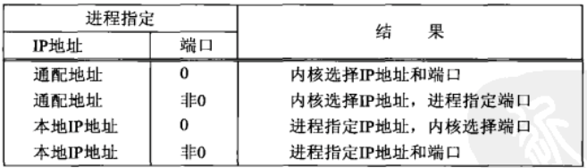

## socket函数

为了执行网络I/O，一个进程必须做的第一件事就是调用socket函数，指定期望的通信协议类型。



#include<sys/socket.h>
int socket(int family, int type,int protocol);
//成功返回非负描述符，失败返回-1



其中family参数指明协议族，type参数指明套接字类型，protocol参数应设为某个协议类型常值，或者设为0，以选择所给定family和type组合的系统默认值。

## connect函数

TCP客户用connect来建立与TCP服务器的连接。



#include<sys/socket.h>
int connect(int sockfd, const struct sockaddr *server, socklen_t addrlen);
//成功则返回0，失败返回-1



sockfd是由socket函数返回的套接字描述符，第二个，第三个函数分别是一个指向套接字地址结构的指针和该结构的大小。

客户在调用connect前不必非得调用bind函数，因为如果需要的话，内核会确定源IP地址，并选择一个临时端口作为源端口。

如果是TCP套接字，调用connect将激发三次握手过程，而且仅在连接建立成功或出错才返回，其中出错返回可能有以下几种情况：

* 若TCP客户端没有收到SYN分节的响应，则返回ETIMEOUT错误。客户端每次间隔一段时间发送一次SYN，一定时间后仍收到响应返回此结果。
* 若对客户的SYN的响应是RST，则表明该服务器主机在我们指定的端口上没有进程在等待与之连接。这是一种硬错误，客户一接收到RST马上返回ECONNREFUSED错误。

产生RST的三个条件是：目的地为某端口的SYN到达，然而该端口上没有正在监听的服务器；TCP想取消一个已有连接；TCP接收到一个根本不存在的连接上的分节。

* 若客户发出的SYN在中间的某个路由器上引发了一个"destination unreachable"（目的地不可达）ICMP错误，则认为是一种软错误，客户主机保存该消息，并按第一种情况中的时间间隔继续发送SYN。若在某个规定的时间内仍未收到响应，则把保存的消息作为EHOSTUNREACH或ENETUNREACH错误返回给进程。以下两种情形也是可能的：一是按照本地的转发表，根本没有到达远程系统的路径。二是connect调用根本不等待就返回。

## bind函数

bind函数把一个本地协议地址赋予一个套接字。协议地址是32位的IPv4地址或128位的IPv6地址与16位的TCP或UDP端口号。



#inlcude<sys/socket.h>
int bind(int sockfd,strcut sockaddr* addr, socklen_t len);
//若成功则返回0，失败返回-1



第二个参数是一个指向特定协议地址结构的指针，第三个参数是该地址结构的长度。调用bind函数可以指定一个端口号，或指定一个IP地址，也可以两者都指定，还可以两者都不指定。

* 服务器在启动时捆绑他们众所周知的端口，如果一个TCP客户或服务器未曾调用bind绑定一个端口，当调用connect或listen时，内核就要为相应的套接字选择一个临时端口。让内核来选择临时端口对于TCP客户来说是正常的；然而对于TCP服务器来说却极为罕见，因为服务器是通过他们众所周知的端口被大家认识的。
* 进程可以把一个IP捆绑到它的套接字上，不过这个IP必须属于其所在主机的网络接口之一。对于TCP客户，这就为在该套接字上发送的IP数据报指定了源IP地址。对于TCP服务器，这就限定该套接字只接收那些目的地址为这个IP地址的客户连接。

## listen函数

listen函数仅有TCP服务器调用，它做两件事：

* 当socket函数创建一个套接字时，它被假设为一个主动套接字，也就是说，它是一个将调用connect发起连接的客户套接字，listen函数把一个未连接的套接字转换成被动套接字，指示内核该接受指向该套接字的请求。
* 本函数的第二个参数规定了内核应该为相应套接字排队的最大连接。



#include<sys/socket.h>
int listen(int sockfd, int backlog);
//若成功返回0，失败返回-1


内核为任何一个给定套接字维护两个队列：

* 未完成连接队列，每个这样的SYN分节对应其中一项：已由某个客户发出并到达服务器，而服务器正在等待完成相应的TCP三路握手过程。这些套接字处于SYN——RCVD状态。
* 已完成连接队列，每个已完成TCP三次握手的客户对应其中的一项。这些套接字处于ESTABLISHED。

当来自客户的SYN到达时，TCP在未完成连接队列中创建一个新项，然后响应以三路握手中的第二个分节：服务器的SYN响应，其中捎带对客户SYN的ACK。这一项一直保留在未完成连接队列中，直到三路握手中的第三个分节到达或者该项超时为止。如果三次握手正常完成，该项就从未完成连接队列中移到已完成连接队列尾。当进程调用accept，已完成连接队列中的队头项将返回给进程，或者如果该队列为空，那么进程将投入睡眠，直到TCP在该队列中放入一项才唤醒它。

关于这两个队列的处理，以下几点需要考虑：

* listen函数的backlog参数曾被规定为这两个队列的总和。
* 源自Berkeley的实现给backlog增设了一个模糊因子：把它乘以1.5得到未处理队列最大长度。
* 不要把backlog设置为0
* 在三次握手正常完成的前提下，未完成连接队列中的任何一项在其中存留的时间就是一个RTT，而RTT的值取决于特定的客户与服务器。
* 历来沿用的样例总是给出值为5的backlog，因为这是4.2BSD支持的最大值。
* 当一个客户SYN到达时，若这些队列是满的TCP就忽略该分节，也就是不发送RST。这是因为这种情况是暂时的，客户会重新发送SYN，期望不久就能在这些队列中找到可用空间。
* 在三次握手之后，服务器accept之前到达的数据应由服务器TCP排队，最大的数据量为相应已连接套接字的接收缓冲区大小。

## accept函数

accept函数由TCP服务器调用，用于从已完成连接队列队头返回下一个已完成连接。如果已完成连接队列为空，则进程被投入睡眠。



#include<sys/socket.h>
int accept(int sockfd,struct sockaddr *addr, socklen_t len);
//若成功则返回非负描述符，否则返回-1



参数addr和len用来返回已连接对端进程的协议地址。len是值-结果参数。如果accept成功返回，那么其返回值是由内核自动生成的一个全新的描述符，代表所返回客户的TCP连接。

在讨论accpet函数时，我们称它的第一个参数为监听套接字，称它的返回值为已连接套接字。一个服务器通常仅仅创建一个监听套接字，它在该服务器的生命期中一直存在，内核为每个由服务器进程接收的客户连接创建一个已连接套接字。当服务器完成对某个客户的服务时，相应的已连接套接字就被关闭。



#include"unp.h"
#include<time.h>

int main(int argc,char* argv[])
{
    int listenfd,sockfd;
    struct sockaddr_in serv_sockaddr,clien_sockaddr;
    socklen_t socklen;
    char buf[MAXLEN];
    time_t ticks;

    listenfd = socket(AF_INET, SOCK_STREAM, 0);
    serv_sockaddr.sin_family = AF_INET;
    serv_sockaddr.sin_addr.s_addr = htonl(INADDR_ANY);
    serv_sockaddr.sin_port = htons(SERV_PORT);

    bind(listenfd, (const struct sockaddr*) &serv_sockaddr, sizeof(serv_sockaddr));
    listen(listenfd, LISTENQ);

    for(;;)
    {
        socklen = sizeof(clien_sockaddr);
        sockfd = accept(listenfd, (struct sockaddr*) &clien_sockaddr, &socklen);
        printf("connection from %s,port %d\n", inet_ntop(AF_INET, &clien_sockaddr.sin_addr, buf,sizeof(buf)),ntohs(clien_sockaddr.sin_port));
        ticks = time(NULL);
        snprintf(buf, sizeof(buf), "%.24s\r\n", ctime(&ticks));
        write(sockfd, buf, strlen(buf));
    }
    return 0;
}



## fork和exec函数

fork是unix中派生新进程的唯一方法。



#include<unistd.h>
int fork();
//在子进程返回0，父进程返回子进程ID，出错返回-1



fork有两个典型用法：

* 一个进程创建一个自身的副本，这样每个副本都可以在另一个副本执行其他任务时同时处理各自的操作。
* 一个进程想要执行另一个程序。fork之后执行exec系列函数。

exec系列函数之间的区别在于：

* 待执行的程序文件是由文件名还是由路径名指定
* 新程序的参数是一一列出还是由一个指针数组来引用
* 把调用进程的环境传递给新程序还是给新程序指定新的环境



#include<unistd.h>

int execl(const char* pathname, const char* arg0,...);

int execv(const char* pathname, char *const argv[]);

int execle(const char* pathname, const char* arg0,..., char* const envp[]);

int execve(const char* pathname, char* const argv[], char* const envp[]);

int execlp(const char* pathname, const char *arg0,...);

int execvp(const char* pathname, char* const argv[]);



只有execve是内核中的系统调用，其他5个都是调用execve的库函数。

## 并发服务器

每个文件或套接字都有一个引用计数。它是当前打开着的引用该文件或套接字的描述符的个数。socket返回后与listenfd关联的文件表项的引用计数值为1。accept返回后与sockfd关联的文件表项的引用计数值也为1。fork之后，这两个描述符就在父进程与子进程之间共享。因此与这两个套接字相关联的文件表项各自访问计数值均为2。当父进程关闭sockfd，只是把相应的引用计数值从2减为1。该套接字真正清理和资源释放要等到其引用计数值到达0时才发生。这会在稍后子进程也关闭connfd时发生。

## close函数

通常unix close函数也用来关闭套接字，并终止TCP连接。



#include<unistd.h>

int close(int sockfd);



如果确实想在某个TCP连接上发送一个FIN，那么可以改用shutdown函数。

## getsockname和getpeername函数

这两个函数或者返回某个套接字关联的本地协议地址（getsockname），或者返回与某个套接字关联的外地协议地址（getpeername）。



#include<sys/socket.h>
int getsockname(int fd, struct sockaddr *lockaddr, socklen_t addrlen);
int getpeername(int fd, struct sockaddr *perraddr, socklen_t addrlen);
//若成功则返回0，出错返回-1



* 在一个没有调用bind的TCP客户上，connect成功返回后，getsockname用于返回由内核赋予该连接的本地IP和端口号。
* 在以端口号0调用bind后，getsockname用于返回由内核赋予的本地端口号
* getsockname可用于获取某个套接字地址族
* 在一个以通配IP地址调用bind的TCP服务器上，与某个客户的连接一旦建立，getsockname就可以用于返回由内核赋予该连接的本地IP地址。这样的调用中，套接字描述符参数必须是已连接套接字描述符，而不是监听套接字的描述符
* 当一个服务器是由调用过accept的某个进程通过调用exec执行程序时，它能够获取客户身份的唯一途径就是通过getpeername。exec后子进程中存放客户地址的结构被释放，只有通过传递已连接套接字描述符，然后调用getpeername获取客户身份信息。